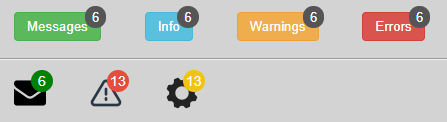

# KM Badge

KM Badge is a web component for displaying badges.  
After including `/src/km-badge.js` you can use `<km-badge></km-badge>` in your HTML.



## Goals

- The aim of this project is to provide a minimal example for implementing and testing a web component.
- For demonstration purposes:
    - Written in vanilla JS
    - Has no runtime dependencies
    - Has minimal devDependencies for testing
    - Has a simple class for manually rendering HTML elements in the browser during tests
    - Has a simple "pulse circle" css animation

## Usage

Check out the provided examples. 
Insert `<km-badge></km-badge>` inside a relatively positioned parent, 
and the web component will load with default attribute values. The web 
component accepts optional attributes, e.g. `<km-badge text="3" has-
animation="true"></km-badge>`. 
It also reacts to setting, removing or changing the value of an attribute,
which can be used for data-binding. 

Optional attributes with their default values:

```
text: 0,
text-color: #ffffff,
background-color: #008100,
border-color: transparent,
has-animation: false,
position: top-right,
```
